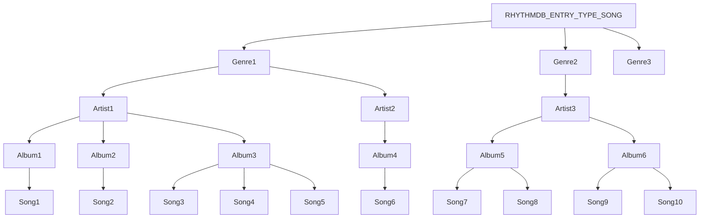

Title: Rhythmbox internals
Slug: internals

# Rhythmbox Internals

This document will attempt to gather up some of the bits and pieces
I've learned while hacking Rhythmbox.  Rhythmbox is fairly complex,
and while some people would claim it is unnecessarily so, I think
writing a good music player is just not as simple as you might
think at first.  So, let's begin.  We'll start from the lower layers of
the internal dependency stack, and build up.

## RBMetadata

This class handles extracting tag information from files, and in the
future it will also handle writing.  To improve reliability, the
implementation transparently performs metadata extraction in a separate
process.

## RBPlayer

This class basically takes as input a URI, and handles playing it.  It
has two current implementations - a straightforward one using the GStreamer
playbin element, and a more complicated one that implements crossfading
with a custom GStreamer pipeline.  It depends on RBMetadata, since it
can advertise tag information only received during playback (such as from
internet radio).

## RhythmDB

This class is kind of an internal database which stores all the tag
information acquired from RBMetadata, as well as other things such
as the user song ratings and last play times.

Basically, it's a queryable cache.  The idea is for it to have
pluggable backends; right now it just stores everything in an
XML file.

RhythmDB has multiple threads; we'll talk later about thread safety.

### RhythmDBEntry

The core data type is RhythmDBEntry - this is an abstract pointer
which represents either a a local song in the library, or internet
radio station.

#### Dynamic properties

Each RhythmDBEntry has a set of properties associated with it.  A
property has both an ID and a value.  The value can be of many
different types; e.g. a string, integer, or float.

These dynamic properties pretty much correspond to the song
metadata you can see like song length, duration, location, etc.

### RhythmDBTree

As we mentioned before, RhythmDB was designed to have multiple storage
backends - for instance, you could store all your music data in a SQL
database.  However, the current default implementation uses a
tree-structured in-memory database.

The tree goes from Genre -> Artist -> Album -> Song.  This is what
allows it to efficiently implement the browser (filtering by genre,
artist, album).  When you click on say an artist, Rhythmbox just
searches for songs in that subtree.  Here's a picture:

RhythmDBTree does a lot of work to maintain this tree structure - it
can handle you changing just the artist of a song.

There is actually one of these trees for each "type" of RhythmDBEntry.
The main type is `RHYTHMDB_ENTRY_TYPE_SONG`, but there is also
`RHYTHMDB_ENTRY_TYPE_IRADIO_STATION` for Internet Radio stations.

#### Saving/loading

RhythmDBTree can serialize and deserialize all the RhythmDBEntries to
a custom XML format.  This actually runs in a separate thread when you
first start up Rhythmbox.

#### RhythmDBQueryModel

This is a *very* important class.  It holds a sequence of
RhythmDBEntries.  A RhythmDBQueryModel is used to store the results of
a query. It automatically remembers its query, and watches the
database for changes.

A RhythmDBQueryModel is the "bridge" between the various RhythmDB
database threads and the main GTK display.

#### RhythmDBPropertyModel

This class "attaches" to a RhythmDBQueryModel and keeps track of a
list of a certain property, such as `RHYTHMDB_PROP_ALBUM`.

## widgets

This directory holds a lot of random widgets that Rhythmbox uses.
Here are some examples:

### RBEntryView:

This widget provides a view of a RhythmDBQueryModel.  It is the main
song list you see in all the sources.

### RBPropertyView:

Similar to RBEntryView, this widget provides a view of a
RhythmDBPropertyModel.

## Sources

Rhythmbox has an idea of multiple music "sources", like the Library
and (Internet) Radio.  The RBSource classes are basically the
user interface part of the "source" concept.

All of these sources derive from RBSource (sources/rb-source.[ch]),
which is an abstract base class.  RBSource has a number of methods
which the specific sources like the Library implement.  For example,
one of the simpler ones is:

`gboolean	rb_source_can_pause		(RBSource *player);`

So here, a source returns TRUE if it can pause (i.e. pause button should
be displayed).  Another example is the `rb_source_get_status` method,
which is called to display a status string at the bottom of the window.

The RBShell maintains a list of available RBSources.

## The Shell

Finally, the shell is the outer Rhythmbox framework.  It controls the
playback, menus, preferences, and most of the user interface in
general.  The core component of the shell is RBShell, in
`shell/rb-shell.c`.  It acts as kind of a catch-all for the various bits
of glue needed to keep Rhythmbox working together.  It "owns" most of
the core data structures and the UI.

The shell is broken up into a number of subcomponents.

### RBShellPlayer

This widget handles the play/previous/next buttons, and contains
various other widgets for the status display and volume.
RBShellPlayer is a pretty important class, because it contains a lot
of the playback logic.  However, it delgates a fair amount of this to:

### RBPlayOrder (and subclasses)

These classes handle playing back a group of songs in a certain order.  They
are used by RBShellPlayer.

### RBSourceToolbar
This is the thingy with the "Hide Browser" button and the search entry.

### RBShellPreferences
This manages the user preferences.  It is just a dialog box
which pops up when you hit Edit->Preferences.

### RBPlaylistManager
This takes care of any kind of playlist request, such as the "New Playlist"
menu item, or drag and drop of an artist (which creates a playlist).

